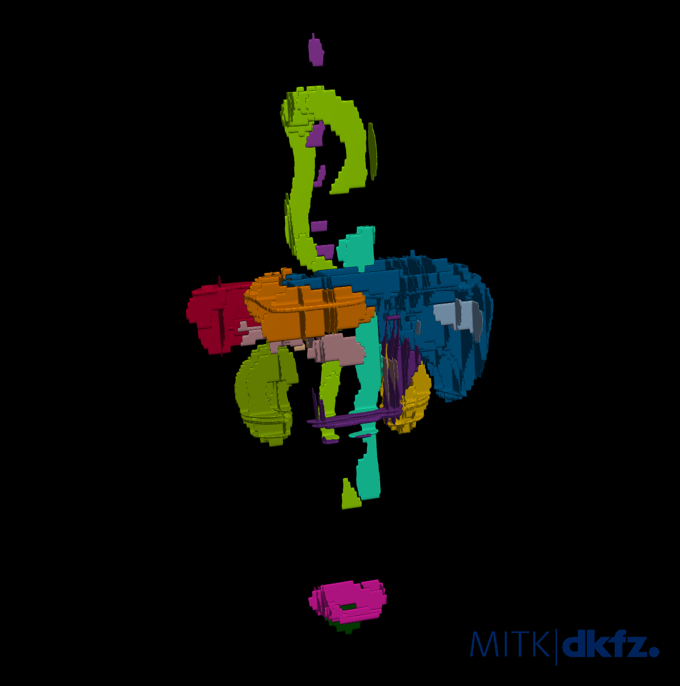

# Ignore Label


## What is this about?
The _ignore label_ can be used to mark regions that should be ignored by nnU-Net. No gradients are propagated from 
pixels marked with ignore label and these pixels will also be excluded from model evaluation. The two most common 
use-cases for the ignore label are sparse annotations (labeling just a subset of slices, scribble annotations etc) or 
defining areas within the image that should be ignored for other reasons.

The most useful application of the ignore label certainly (according to us) is sparse data annotation. To drive home 
this point, we conducted an experiment on the [AMOS2022 dataset](https://amos22.grand-challenge.org/):

- Baseline: simulate less annotation effort by simply reducing the number of train cases
- Sparse annotation: annotate a certain percentage of slices (randomly selected) for all cases

As an example, sparse annotations with 10% of slices annotated look like this:



Note that the ignore label is explicitly shown in red (left) but not in the 3D rendering. The background class must 
also be annotated, here it is rendered transparent (don't forget it!). 3D rendering was generated with 
[MITK](https://www.mitk.org/wiki/The_Medical_Imaging_Interaction_Toolkit_(MITK))

With this setting, we were able to simulate different dataset coverages and can compare annotation efficiency:


Evidently (and not surprisingly), annotation effort invested in covering as many cases as possible yield much higher 
scores than covering fewer cases! Naturally, as part of this comparison one must in principle also consider that annotating 
individual slices might be less time efficient due to different annotation tools and the constant need for the 
annotator to reorient themselves in the image. However, the differences are so large that sparse annotations are 
clearly a promising direction to consider!


## How to use it in nnU-Net

The ignore label MUST be the highest integer label value in your segmentations! So if you have background + 2 real 
labels then the ignore label must be value 3! (Remember that nnU-Net expects your labels to be consecutive integers!)

First you need to generate sparse annotations (duh). This is best done by first setting the entire segmentation to 
ignore label, and then annotating selected regions. The form of these regions doesn't matter. It can be slices, 
patches, scribbles, individual pixels or whatever your heart desires. 

The ignore label must be declared as "ignore" in the dataset.json (BraTS used as an example):

```python
...
"labels": {
    "background": 0,
    "edema": 1,
    "non_enhancing_and_necrosis": 2,
    "enhancing_tumor": 3,
    "ignore": 4
},
...
```

Of course, the ignore label is compatible with [region-based training](region_based_training.md):

```python
...
"labels": {
    "background": 0,
    "whole_tumor": (1, 2, 3),
    "tumor_core": (2, 3),
    "enhancing_tumor": 3,  # or (3, )
    "ignore": 4
},
"regions_class_order": (1, 2, 3),  # dont declare ignore label here! It is not predicted (duh)
...
```

Then use the dataset as you would any other.

Remember that nnU-Net runs a cross-validation. Thus, it will also evaluate on your partially annotated data. This 
will of course work! If you wish to compare different sparse annotation strategies (through simulations for example),
we recommend to evaluate on densely annotated images by running inference and then using `nnUNetv2_evaluate_folder` or 
`nnUNetv2_evaluate_simple`.