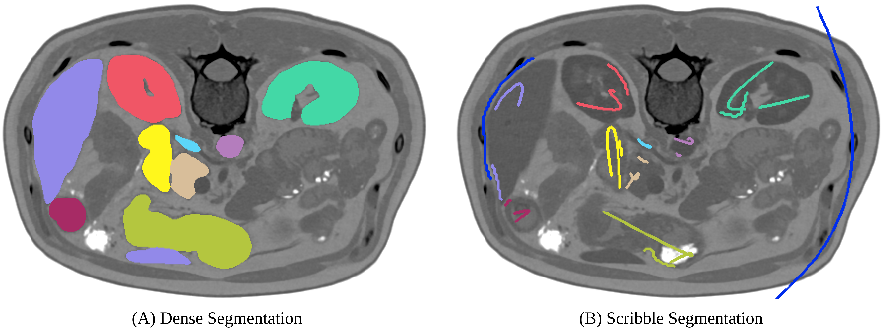

# Ignore Label

The _ignore label_ can be used to mark regions that should be ignored by nnU-Net. This can be used to 
learn from images where only sparse annotations are available, for example in the form of scribbles or a limited 
amount of annotated slices. Internally, this is accomplished by using partial losses, i.e. losses that are only 
computed on annotated pixels while ignoring the rest. Take a look at our 
[`DC_and_BCE_loss` loss](../nnunetv2/training/loss/compound_losses.py) to see how this is done.
During inference (validation and prediction), nnU-Net will always predict dense segmentations. Metric computation in 
validation is of course only done on annotated pixels.

Using sparse annotations can be used to train a model for application to new, unseen images or to autocomplete the 
provided training cases given the sparse labels. 

(See our [paper](https://arxiv.org/abs/2403.12834) for more information)

Typical use-cases for the ignore label are:
- Save annotation time through sparse annotation schemes
  - Annotation of all or a subset of slices with scribbles (Scribble Supervision)
  - Dense annotation of a subset of slices 
  - Dense annotation of chosen patches/cubes within an image
- Coarsely masking out faulty segmentations in the reference segmentations
- Masking areas for other reasons

If you are using nnU-Net's ignore label, please cite the following paper in addition to the original nnU-Net paper:

```text
Gotkowski, K., Lüth, C., Jäger, P. F., Ziegler, S., Krämer, L., Denner, S., Xiao, S., Disch, N., H., K., & Isensee, F. 
(2024). Embarrassingly Simple Scribble Supervision for 3D Medical Segmentation. ArXiv. /abs/2403.12834
```

## Usecases

### Scribble Supervision

Scribbles are free-form drawings to coarsely annotate an image. As we have demonstrated in our recent [paper](https://arxiv.org/abs/2403.12834), nnU-Net's partial loss implementation enables state-of-the-art learning from partially annotated data and even surpasses many purpose-built methods for learning from scribbles. As a starting point, for each image slice and each class (including background), an interior and a border scribble should be generated:

- Interior Scribble: A scribble placed randomly within the class interior of a class instance
- Border Scribble: A scribble roughly delineating a small part of the class border of a class instance

An example of such scribble annotations is depicted in Figure 1 and an animation in Animation 1.
Depending on the availability of data and their variability it is also possible to only annotate a subset of selected slices.

<p align="center">
    <figure>
        
        <figcaption>Figure 1: Examples of segmentation types with (A) depicting a dense segmentation and (B) a scribble segmentation.</figcaption>
    </figure>
</p>

<p align="center">
    <figure>
        
        
        <figcaption>Animation 1: Depiction of a dense segmentation and a scribble annotation. Background scribbles have been excluded for better visualization.</figcaption>
    </figure>
</p>

### Dense annotation of a subset of slices

Another form of sparse annotation is the dense annotation of a subset of slices. These slices should be selected by the user either randomly, based on visual class variation between slices or in an active learning setting. An example with only 10% of slices annotated is depicted in Figure 2.

<p align="center">
    <figure>
        
        
        <figcaption>Figure 2: Examples of a dense annotation of a subset of slices. The ignored areas are shown in red.</figcaption>
    </figure>
</p>


## Usage within nnU-Net

Usage of the ignore label in nnU-Net is straightforward and only requires the definition of an _ignore_ label in the _dataset.json_.
This ignore label MUST be the highest integer label value in the segmentation. Exemplary, given the classes background and two foreground classes, then the ignore label must have the integer 3. The ignore label must be named _ignore_ in the _dataset.json_. Given the BraTS dataset as an example the labels dict of the _dataset.json_ must look like this:

```json
...
"labels": {
    "background": 0,
    "edema": 1,
    "non_enhancing_and_necrosis": 2,
    "enhancing_tumor": 3,
    "ignore": 4
},
...
```

Of course, the ignore label is compatible with [region-based training](region_based_training.md):

```json
...
"labels": {
    "background": 0,
    "whole_tumor": (1, 2, 3),
    "tumor_core": (2, 3),
    "enhancing_tumor": 3,  # or (3, )
    "ignore": 4
},
"regions_class_order": (1, 2, 3),  # don't declare ignore label here! It is not predicted
...
```

Then use the dataset as you would any other.

Remember that nnU-Net runs a cross-validation. Thus, it will also evaluate on your partially annotated data. This 
will of course work! If you wish to compare different sparse annotation strategies (through simulations for example),
we recommend evaluating on densely annotated images by running inference and then using `nnUNetv2_evaluate_folder` or 
`nnUNetv2_evaluate_simple`.
