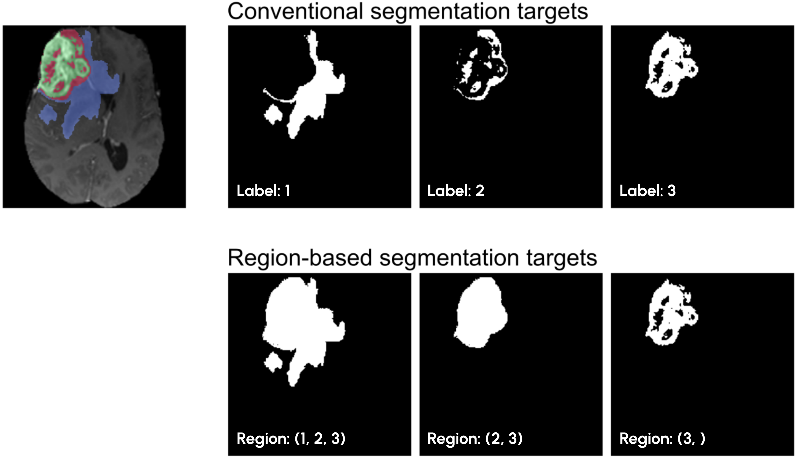

# Region-based training

## What is this about?
In some segmentation tasks, most prominently the 
[Brain Tumor Segmentation Challenge](http://braintumorsegmentation.org/), the target areas (based on which the metric 
will be computed) are different from the labels provided in the training data. This is the case because for some 
clinical applications, it is more relevant to detect the whole tumor, tumor core and enhancing tumor instead of the 
individual labels (edema, necrosis and non-enhancing tumor, enhancing tumor). 



The figure shows an example BraTS case along with label-based representation of the task (top) and region-based 
representation (bottom). The challenge evaluation is done on the regions. As we have shown in our 
[BraTS 2018 contribution](https://arxiv.org/abs/1809.10483), directly optimizing those 
overlapping areas over the individual labels yields better scoring models!

## What can nnU-Net do?
nnU-Net's region-based training allows you to learn areas that are constructed by merging individual labels. For 
some segmentation tasks this provides a benefit, as this shifts the importance allocated to different labels during training. 
Most prominently, this feature can be used to represent **hierarchical classes**, for example when organs + 
substructures are to be segmented. Imagine a liver segmentation problem, where vessels and tumors are also to be 
segmented. The first target region could thus be the entire liver (including the substructures), while the remaining 
targets are the individual substructures.

Important: nnU-Net still requires integer label maps as input and will produce integer label maps as output! 
Region-based training can be used to learn overlapping labels, but there must be a way to model these overlaps 
for nnU-Net to work (see below how this is done).

## How do you use it?

When declaring the labels in the `dataset.json` file, BraTS would typically look like this:

```json
...
"labels": {
    "background": 0,
    "edema": 1,
    "non_enhancing_and_necrosis": 2,
    "enhancing_tumor": 3
},
...
```
(we use different int values than the challenge because nnU-Net needs consecutive integers!)

This representation corresponds to the upper row in the figure above.

For region-based training, the labels need to be changed to the following:

```json
...
"labels": {
    "background": 0,
    "whole_tumor": [1, 2, 3],
    "tumor_core": [2, 3],
    "enhancing_tumor": 3  # or [3]
},
"regions_class_order": [1, 2, 3],
...
```
This corresponds to the bottom row in the figure above. Note how an additional entry in the dataset.json is 
required: `regions_class_order`. This tells nnU-Net how to convert the region representations back to an integer map. 
It essentially just tells nnU-Net what labels to place for which region in what order. The length of the 
list here needs to be the same as the number of regions (excl background). Each element in the list corresponds 
to the label that is placed instead of the region into the final segmentation. Later entries will overwrite earlier ones! 
Concretely, for the example given here, nnU-Net 
will firstly place the label 1 (edema) where the 'whole_tumor' region was predicted, then place the label 2 
(non-enhancing tumor and necrosis) where the "tumor_core" was predicted and finally place the label 3 in the 
predicted 'enhancing_tumor' area. With each step, part of the previously set pixels 
will be overwritten with the new label! So when setting your `regions_class_order`, place encompassing regions 
(like whole tumor etc) first, followed by substructures.

**IMPORTANT** Because the conversion back to a segmentation map is sensitive to the order in which the regions are 
declared ("place label X in the first region") you need to make sure that this order is not perturbed! When 
automatically generating the dataset.json, make sure the dictionary keys do not get sorted alphabetically! Set 
`sort_keys=False` in `json.dump()`!!!

nnU-Net will perform the evaluation + model selection also on the regions, not the individual labels!

That's all. Easy, huh?
