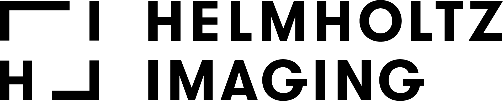

# Welcome to the new nnU-Net!

Click [here](https://github.com/MIC-DKFZ/nnUNet/tree/nnunetv1) if you were looking for the old one instead.

Coming from V1? Check out the [TLDR Migration Guide](documentation/tldr_migration_guide_from_v1.md). Reading the rest of the documentation is still strongly recommended ;-)

# What is nnU-Net?
Image datasets are enormously diverse: image dimensionality (2D, 3D), modalities/input channels (RGB image, CT, MRI, microscopy, ...), 
image sizes, voxel sizes, class ratio, target structure properties and more change substantially between datasets. 
Traditionally, given a new problem, a tailored solution needs to be manually designed and optimized  - a process that 
is prone to errors, not scalable and where success is overwhelmingly determined by the skill of the experimenter. Even 
for experts, this process is anything but simple: there are not only many design choices and data properties that need to 
be considered, but they are also tightly interconnected, rendering reliable manual pipeline optimization all but impossible! 

**nnU-Net is a semantic segmentation method that automatically adapts to a given dataset. It will analyze the provided 
training cases and automatically configure a matching U-Net-based segmentation pipeline. No expertise required on your 
end! You can simply train the models and use them for your application**.

Upon release, nnU-Net was evaluated on 23 datasets belonging to competitions from the biomedical domain. Despite competing 
with handcrafted solutions for each respective dataset, nnU-Net's fully automated pipeline scored several first places on 
open leaderboards! Since then nnU-Net has stood the test of time: it continues to be used as a baseline and method 
development framework ([9 out of 10 challenge winners at MICCAI 2020](https://arxiv.org/abs/2101.00232) and 5 out of 7 
in MICCAI 2021 built their methods on top of nnU-Net, 
 [we won AMOS2022 with nnU-Net](https://amos22.grand-challenge.org/final-ranking/))!

Please cite the [following paper](https://www.google.com/url?q=https://www.nature.com/articles/s41592-020-01008-z&sa=D&source=docs&ust=1677235958581755&usg=AOvVaw3dWL0SrITLhCJUBiNIHCQO) when using nnU-Net:

    Isensee, F., Jaeger, P. F., Kohl, S. A., Petersen, J., & Maier-Hein, K. H. (2021). nnU-Net: a self-configuring 
    method for deep learning-based biomedical image segmentation. Nature methods, 18(2), 203-211.

## What can nnU-Net do for you?
If you are a **domain scientist** (biologist, radiologist, ...) looking to analyze your own images, nnU-Net provides 
an out-of-the-box solution that is all but guaranteed to provide excellent results on your individual dataset. Simply 
convert your dataset into the nnU-Net format and enjoy the power of AI - no expertise required!

If you are an **AI researcher** developing segmentation methods, nnU-Net:
- offers a fantastic out-of-the-box applicable baseline algorithm to compete against
- can act as a method development framework to test your contribution on a large number of datasets without having to 
tune individual pipelines (for example evaluating a new loss function)
- provides a strong starting point for further dataset-specific optimizations. This is particularly used when competing 
in segmentation challenges
- provides a new perspective on the design of segmentation methods: maybe you can find better connections between 
dataset properties and best-fitting segmentation pipelines?

## What is the scope of nnU-Net?
nnU-Net is built for semantic segmentation. It can handle 2D and 3D images with arbitrary 
input modalities/channels. It can understand voxel spacings, anisotropies and is robust even when classes are highly
imbalanced.

nnU-Net relies on supervised learning, which means that you need to provide training cases for your application. The number of 
required training cases varies heavily depending on the complexity of the segmentation problem. No 
one-fits-all number can be provided here! nnU-Net does not require more training cases than other solutions - maybe 
even less due to our extensive use of data augmentation. 

nnU-Net expects to be able to process entire images at once during preprocessing and postprocessing, so it cannot 
handle enormous images. As a reference: we tested images from 40x40x40 pixels all the way up to 1500x1500x1500 in 3D 
and 40x40 up to ~30000x30000 in 2D! If your RAM allows it, larger is always possible.

## How does nnU-Net work?
Given a new dataset, nnU-Net will systematically analyze the provided training cases and create a 'dataset fingerprint'. 
nnU-Net then creates several U-Net configurations for each dataset: 
- `2d`: a 2D U-Net (for 2D and 3D datasets)
- `3d_fullres`: a 3D U-Net that operates on a high image resolution (for 3D datasets only)
- `3d_lowres` → `3d_cascade_fullres`: a 3D U-Net cascade where first a 3D U-Net operates on low resolution images and 
then a second high-resolution 3D U-Net refined the predictions of the former (for 3D datasets with large image sizes only)

**Note that not all U-Net configurations are created for all datasets. In datasets with small image sizes, the 
U-Net cascade (and with it the 3d_lowres configuration) is omitted because the patch size of the full 
resolution U-Net already covers a large part of the input images.**

nnU-Net configures its segmentation pipelines based on a three-step recipe:
- **Fixed parameters** are not adapted. During development of nnU-Net we identified a robust configuration (that is, certain architecture and training properties) that can 
simply be used all the time. This includes, for example, nnU-Net's loss function, (most of the) data augmentation strategy and learning rate.
- **Rule-based parameters** use the dataset fingerprint to adapt certain segmentation pipeline properties by following 
hard-coded heuristic rules. For example, the network topology (pooling behavior and depth of the network architecture) 
are adapted to the patch size; the patch size, network topology and batch size are optimized jointly given some GPU 
memory constraint. 
- **Empirical parameters** are essentially trial-and-error. For example the selection of the best U-net configuration 
for the given dataset (2D, 3D full resolution, 3D low resolution, 3D cascade) and the optimization of the postprocessing strategy.

## How to get started?
Read these:
- [Installation instructions](documentation/installation_instructions.md)
- [Dataset conversion](documentation/dataset_format.md)
- [Usage instructions](documentation/how_to_use_nnunet.md)

Additional information:
- [Region-based training](documentation/region_based_training.md)
- [Manual data splits](documentation/manual_data_splits.md)
- [Pretraining and finetuning](documentation/pretraining_and_finetuning.md)
- [Intensity Normalization in nnU-Net](documentation/explanation_normalization.md)
- [Manually editing nnU-Net configurations](documentation/explanation_plans_files.md)
- [Extending nnU-Net](documentation/extending_nnunet.md)
- [What is different in V2?](documentation/changelog.md)

[//]: # (- [Ignore label]&#40;documentation/ignore_label.md&#41;)

## Where does nnU-net perform well and where does it not perform?
nnU-Net excels in segmentation problems that need to be solved by training from scratch, 
for example: research applications that feature non-standard image modalities and input channels,
challenge datasets from the biomedical domain, majority of 3D segmentation problems, etc . We have yet to find a 
dataset for which nnU-Net's working principle fails!

Note: On standard segmentation 
problems, such as 2D RGB images in ADE20k and Cityscapes, fine-tuning a foundation model (that was pretrained on a large corpus of 
similar images, e.g. Imagenet 22k, JFT-300M) will provide better performance than nnU-Net! That is simply because these 
models allow much better initialization. Foundation models are not supported by nnU-Net as 
they 1) are not useful for segmentation problems that deviate from the standard setting (see above mentioned 
datasets), 2) would typically only support 2D architectures and 3) conflict with our core design principle of carefully adapting 
the network topology for each dataset (if the topology is changed one can no longer transfer pretrained weights!) 

## What happened to the old nnU-Net?
The core of the old nnU-Net was hacked together in a short time period while participating in the Medical Segmentation 
Decathlon challenge in 2018. Consequently, code structure and quality were not the best. Many features 
were added later on and didn't quite fit into the nnU-Net design principles. Overall quite messy, really. And annoying to work with.

nnU-Net V2 is a complete overhaul. The "delete everything and start again" kind. So everything is better 
(in the author's opinion haha). While the segmentation performance [remains the same](https://docs.google.com/spreadsheets/d/13gqjIKEMPFPyMMMwA1EML57IyoBjfC3-QCTn4zRN_Mg/edit?usp=sharing), a lot of cool stuff has been added. 
It is now also much easier to use it as a development framework and to manually fine-tune its configuration to new 
datasets. A big driver for the reimplementation was also the emergence of [Helmholtz Imaging](http://helmholtz-imaging.de), 
prompting us to extend nnU-Net to more image formats and domains. Take a look [here](documentation/changelog.md) for some highlights.

# Acknowledgements

nnU-Net is developed and maintained by the Applied Computer Vision Lab (ACVL) of [Helmholtz Imaging](http://helmholtz-imaging.de) 
and the [Division of Medical Image Computing](https://www.dkfz.de/en/mic/index.php) at the 
[German Cancer Research Center (DKFZ)](https://www.dkfz.de/en/index.html).
