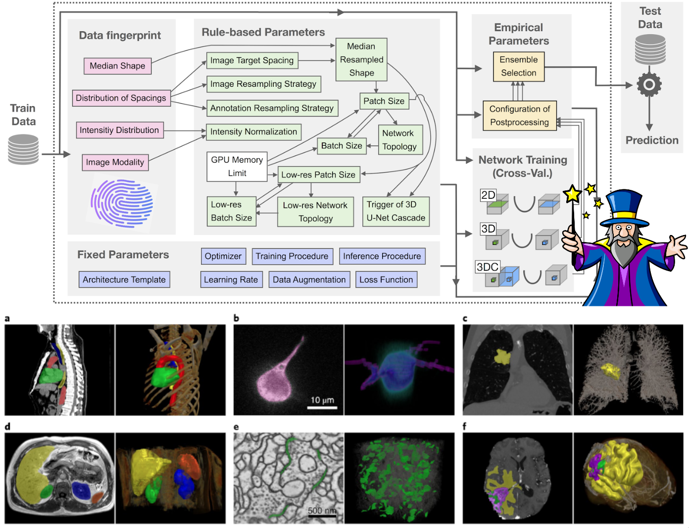

# nnU-Net

nnU-Net is a semantic segmentation framework that automatically adapts its pipeline to a dataset. It analyzes the training data, creates a dataset fingerprint, configures suitable U-Net variants, and provides an end-to-end workflow from preprocessing to training, model selection, and inference.

It is primarily designed for supervised biomedical image segmentation, but it also works well as a strong baseline and development framework for researchers working on new segmentation methods.

If you are looking for nnU-Net v1, use the [v1 branch](https://github.com/MIC-DKFZ/nnUNet/tree/nnunetv1). If you are migrating from v1, start with the [TLDR migration guide](documentation/tldr_migration_guide_from_v1.md).



## Start Here

- First-time setup: [Installation and setup](documentation/getting-started/installation-and-setup.md)
- First run on your own data: [Getting Started](documentation/getting-started/README.md)
- Task-oriented docs: [How-to Guides](documentation/how-to/README.md)
- Formats, commands, and configuration details: [Reference](documentation/reference/README.md)
- Concepts and rationale: [Explanation](documentation/explanation/README.md)

## Quick Install

Install PyTorch for your hardware first, then install nnU-Net:

```bash
pip install nnunetv2
```

For the full setup, including `nnUNet_raw`, `nnUNet_preprocessed`, and `nnUNet_results`, see [Installation and setup](documentation/getting-started/installation-and-setup.md).

## Documentation

Start with the [documentation home](documentation/README.md).

Useful entry points:

- New users: [Getting Started](documentation/getting-started/README.md)
- Dataset preparation: [Prepare a dataset](documentation/how-to/prepare-a-dataset.md)
- Training workflow: [Train models](documentation/how-to/train-models.md)
- Inference workflow: [Run inference](documentation/how-to/run-inference.md)
- Recommended residual encoder presets: [Residual Encoder Presets in nnU-Net](documentation/resenc_presets.md)
- Contributing: [CONTRIBUTING.md](CONTRIBUTING.md)

## Scope

nnU-Net is built for supervised semantic segmentation. It supports 2D and 3D data, arbitrary channel definitions, multiple image formats, and dataset-specific adaptation of preprocessing and network configuration.

It performs particularly well in training-from-scratch settings such as biomedical datasets, challenge datasets, and non-standard imaging problems where off-the-shelf natural-image pretrained models are often a poor fit.

For a concise overview of the design, see [How nnU-Net works](documentation/explanation/how-nnunet-works.md).

## Citation

Please cite the following paper when using nnU-Net:

```text
Isensee, F., Jaeger, P. F., Kohl, S. A., Petersen, J., & Maier-Hein, K. H. (2021).
nnU-Net: a self-configuring method for deep learning-based biomedical image segmentation.
Nature Methods, 18(2), 203-211.
```

Additional recent work on residual encoder presets and benchmarking:

- [nnU-Net Revisited: A Call for Rigorous Validation in 3D Medical Image Segmentation](https://arxiv.org/pdf/2404.09556.pdf)

## Project Notes

- nnU-Net v2 is a complete reimplementation of the original nnU-Net with improved code structure and extensibility.
- Not every dataset creates every configuration. For example, the cascade is only generated when the dataset characteristics justify it.
- Detailed historical changes are summarized in [What is different in v2?](documentation/changelog.md).

# Acknowledgements


nnU-Net is developed and maintained by the Applied Computer Vision Lab (ACVL) of [Helmholtz Imaging](http://helmholtz-imaging.de) 
and the [Division of Medical Image Computing](https://www.dkfz.de/en/mic/index.php) at the 
[German Cancer Research Center (DKFZ)](https://www.dkfz.de/en/index.html).
